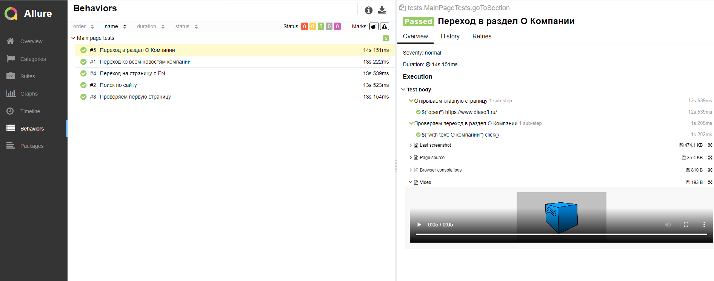

# Учебный проект тестирования веб-сайта
https://www.diasoft.ru/

# Используемые технологии

- Idea
- Java
- Gradle
- Junit5
- Selenide
- Allure
- Jenkins
- Selenoid
- Telegram Bot

# Описание
Учебный проект UI тестирования на сайте https://www.diasoft.ru.

- Тесты запущены из CI системы Jenkins
- Для кросс-браузерного тестирования используется Selenoid
- Сгенерирован отчет Allure, добавлены логи,скриншоты браузера и видео прохождения тестов
- Отчетом тестирования автоматически отправляется в Telegram

## Отчет Allure reports

## Видео прохождения одного из тестов

## Уведомление в Telegram

## Links
### Jenkins
https://jenkins.autotests.cloud/job/c05-kpereverzeva-telegram-5-11/
### Allure reports
https://jenkins.autotests.cloud/job/c05-kpereverzeva-telegram-5-11/17/allure/